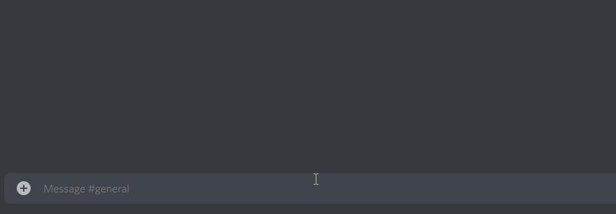

# message-highlighter

A chat bot that allows a user to take a "snapshot" of a message.

## Usage

Install dependencies using npm:
``npm install``

Rename ``authorization.example`` to ``authorization``, and add your bot token.

Change the variables in ``src/config.ts.example``, and rename it to ``config.ts``.

Compile the program with ``tsc``.

Run the program using ``npm start``.

## Example

